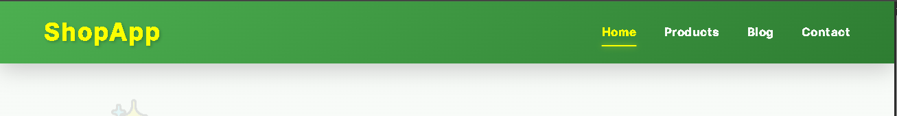
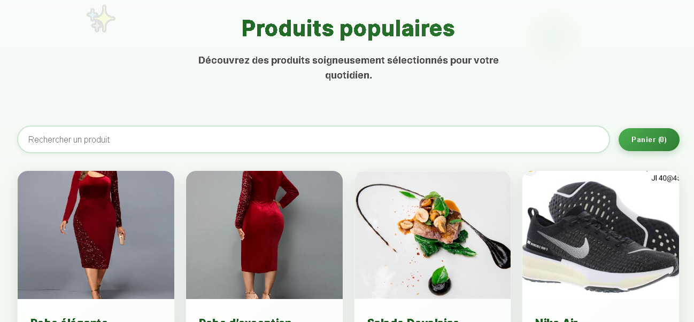
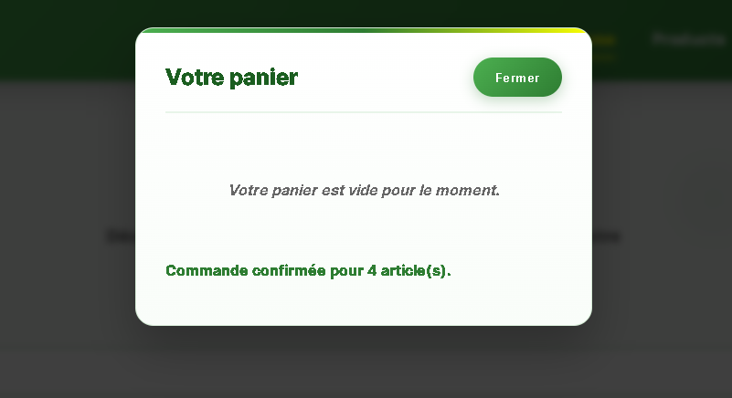
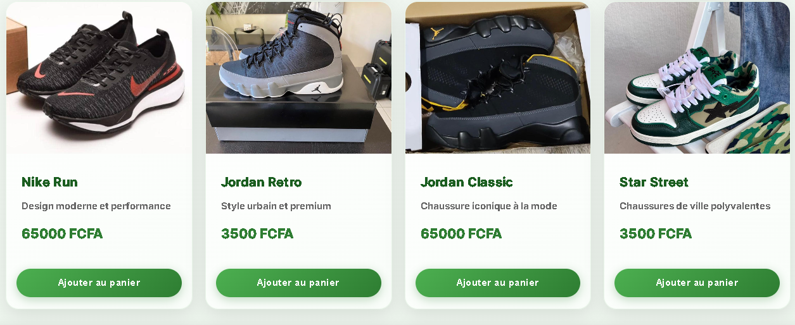
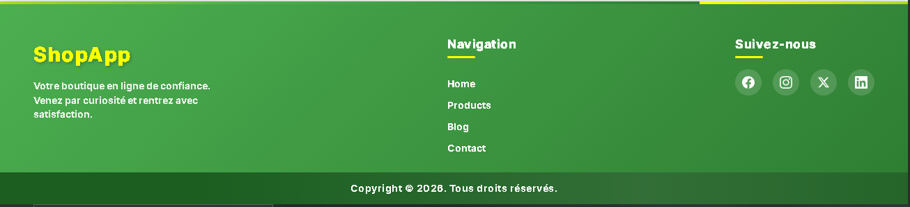

# Shop App - Application E-commerce Moderne


---

## 🚀 Live Demo
👉 https://shop-app-input-output.vercel.app/

---

## 🚀 Aperçu du projet


**Slogan** : *Votre boutique en ligne de confiance*

Shop App est une **application e-commerce moderne** développée avec **Angular 22** en standalone components. Elle présente un catalogue de produits avec un panier d'achat interactif et des animations fluides.

---

## ✨ Fonctionnalités principales

### 🏠 Header
- Navigation sticky avec backdrop blur
- Logo animé avec point doré au hover
- Liens de navigation avec soulignement animé
- Responsive : stack vertical sur mobile

### 🔍 Hero Section
- Titre avec dégradé de texte
- Éléments décoratifs flottants (✨)
- Animations d'entrée (slideInDown, slideInUp)

### 🔎 Recherche de produits
- Barre de recherche en temps réel
- Filtrage par nom de produit
- Design pilule avec focus animé

### 🛍️ Cartes produits
- **8 produits** (robes, chaussures, alimentation)
- Hover effects : élévation + zoom image
- Barre colorée qui apparaît au hover
- Bouton "Ajouter au panier" avec ripple effect

### 🛒 Panier d'achat
- Modal avec overlay flou
- Gestion des quantités (+/-)
- Suppression d'articles
- Calcul automatique du total
- Message de confirmation

### 📍 Footer
- Brand avec logo et description
- Liens de navigation
- Icônes sociales SVG (Facebook, Instagram, Twitter, LinkedIn)
- Copyright statique avec animation shine

---

## 🧠 Points techniques clés

- ✅ **Angular 22** avec Standalone Components
- ✅ **SSR** avec Angular Universal
- ✅ **TypeScript** avec Signal API (état réactif moderne)
- ✅ **Signal()** pour état réactif, **input()/output()** pour communication composants
- ✅ **Responsive mobile-first** (Desktop > 768px, Tablette ≤ 768px, Mobile ≤ 576px)
- ✅ **Animations CSS** (slideInDown, slideInUp, float, pulse, shimmer, fadeIn, cardAppear)
- ✅ **Icons SVG** inline (pas de dépendance externe)
- ✅ **Comments JSDoc** sur modèles et composants principaux
- ✅ **Prettier** pour le linting

---

## 🏗️ Project Architecture

```text
src/
├── app/
│   ├── components/
│   │   ├── header/           # Navigation sticky
│   │   │   ├── header.ts
│   │   │   ├── header.html
│   │   │   └── header.css
│   │   ├── container/        # Store principal (panier + recherche)
│   │   │   ├── container.ts
│   │   │   ├── container.html
│   │   │   └── container.css
│   │   ├── product-list/     # Catalogue produits
│   │   │   ├── product-list.ts
│   │   │   ├── product-list.html
│   │   │   └── product-list.css
│   │   ├── product-item/     # Carte produit individuelle
│   │   │   ├── product-item.ts
│   │   │   ├── product-item.html
│   │   │   └── product-item.css
│   │   └── footer/           # Pied de page
│   │       ├── footer.ts
│   │       ├── footer.html
│   │       └── footer.css
│   ├── models/
│   │   ├── product.ts        # Interface Product
│   │   └── cart-item.ts      # Interface CartItem
│   ├── app.ts                # Composant racine
│   ├── app.config.ts         # Configuration browser
│   └── app.css               # Styles globaux + animations
├── assets/
│   └── images/               # Images des produits
├── styles.css                # Variables CSS globales
└── index.html                # Point d'entrée

docs/
├── implementation.md         # Architecture et modules
├── quick_start.md            # Démarrage rapide
├── guide.md                  # Guide complet (SSR, responsive, images)
├── checklist.md              # Checklist projet
└── README.md                 # Vue d'ensemble (ce fichier)
```

---

## 📸 Screenshots

### 🏠 Header


### 🍽 Container


### 🍽 Carte Panier


### 🍽 Articles


### 🍽 Footer


---

## 🎨 Design System

### Palette de couleurs
- **Vert forêt** (`#4caf50` → `#2e7d32`) : Header, boutons, footer
- **Jaune or** (`#fbff01`) : Accents, logo "App"
- **Vert clair** (`#c8e6c9`) : Bordures
- **Blanc cassé** (`#f9fdf9`) : Cartes produits

### Animations CSS
- **slideInDown** : Entrée du titre hero
- **slideInUp** : Entrée de la description
- **float** : Éléments décoratifs flottants
- **pulse** : Cercles pulsants
- **shimmer** : Effet de brillance sur images/copyright
- **fadeIn** : Apparition douce
- **cardAppear** : Cascade des cartes produits

### Responsive Breakpoints
- **Desktop** : > 768px
- **Tablette** : ≤ 768px
- **Mobile** : ≤ 576px

---

## ⚙️ Installation

```bash
# 1. Cloner le dépôt
git clone https://github.com/Hunter13-cmr/ShopApp-Input-Output.git
cd shop-app

# 2. Installer les dépendances
npm install
# ou
yarn install

# 3. Lancer le serveur de développement
npm start
# ou
yarn start
```

👉 **Accès** : http://localhost:8080

---

## 📦 Production Build

```bash
# Build avec SSR
npm run build

# Preview du build SSR
npm run serve:ssr:shop-app
```

**Output** : `dist/shop-app/browser/`

---

## 🧪 Tests et validation

### Manuel
- [ ] Header affiché avec animations hover
- [ ] Hero section avec animations d'entrée
- [ ] Recherche filtre les produits en temps réel
- [ ] 8 produits affichés dans le catalogue
- [ ] Hover effects sur cartes produits
- [ ] Panier s'ouvre/ferme avec overlay flou
- [ ] Gestion quantités (+/-) fonctionne
- [ ] Suppression d'articles
- [ ] Calcul automatique du total
- [ ] Footer avec icônes sociales
- [ ] Responsive : mobile, tablette, desktop
- [ ] Aucune erreur console (F12)

### Build
```bash
npm run build
```
- [ ] Compilation réussie
- [ ] Budget warnings acceptables (< 1MB)

---

## 📚 Documentation

| Fichier | Description |
|---------|-------------|
| `README.md` | Ce fichier — vue d'ensemble |
| `docs/implementation.md` | Architecture détaillée et modules |
| `docs/quick_start.md` | Démarrage en 3 étapes |
| `docs/guide.md` | Guide complet (SSR, responsive, performances) |
| `docs/checklist.md` | Checklist de vérification complète |

---

## 🗺️ Roadmap

### ✅ MVP (actuel)
- [x] Header + Hero Section
- [x] Recherche produit en temps réel
- [x] Catalogue 8 produits avec animations
- [x] Panier modal avec gestion quantités
- [x] Footer complet avec réseaux sociaux
- [x] Responsive mobile-first
- [x] SSR avec Angular Universal
- [x] Documentation complète

### 🚀 V2 (optionnel)
- [ ] Authentification utilisateur
- [ ] Page produit détaillée
- [ ] Liste de souhaits (wishlist)
- [ ] API backend (Node.js/Express)
- [ ] Base de données (PostgreSQL/MongoDB)
- [ ] Paiement en ligne (Stripe/OM)
- [ ] Internationalisation (fr/en)
- [ ] Tests unitaires (Jest/Vitest)
- [ ] Tests E2E (Playwright/Cypress)
- [ ] PWA

---

## 👨‍💻 Auteur

Développé par **ELOCK SADRACK FIDELE**

Projet Angular – Formation Développement Web Front-end Angular Talent Lab 2026(Orange Digital Center)

---

## 📜 Licence

**Projet académique – libre d'utilisation à des fins éducatives.**

---

<p align="center">
  Fait avec ❤️ à Douala
</p>